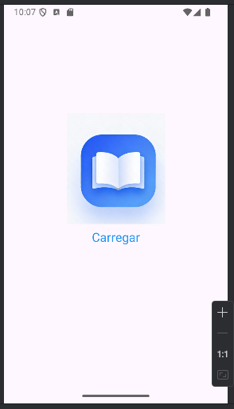
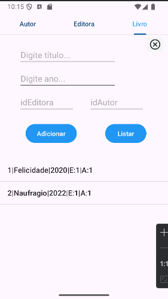

# 📚 Aplicação Android – Gestão de Livros

Aplicação Android desenvolvida no âmbito da unidade curricular de Desenvolvimento de Aplicações Móveis.  
Permite gerir livros, autores e editoras, com dois tipos de utilizadores: **Administrador** e **Utilizador Comum**.

---

## 👥 Tipos de Utilizadores

### 🔐 Administrador
- Pode gerir utilizadores
- Pode gerir toda a base de dados
- Acesso total à aplicação

### 👤 Utilizador Comum
- Pode gerir livros
- Pode gerir editoras
- Pode gerir autores

## 🧠 Funcionalidades Principais
- Autenticação de utilizadores
- Gestão de livros (CRUD)
- Gestão de autores (CRUD)
- Gestão de editoras (CRUD)
- Permite atualizar ou apagar livros/editores/autores selecionando o item na lista.
- Gestão de utilizadores (apenas administrador)
- Interface moderna e intuitiva
- Armazenamento local (SQLite)
- Navegação entre ecrãs (Activities / Fragments)

---
## 🧰 Tecnologias Utilizadas
- Android Studio
- Java (conforme o teu projeto)
- SQLite
---

## ▶️ Como Executar
1. Abrir o projeto no **Android Studio**
2. Sincronizar Gradle
3. Executar num emulador ou dispositivo físico
4. Iniciar sessão com um dos utilizadores disponíveis

---

## 📸 Screenshot

---

## 👤 Autor
**Marco Monteiro**
